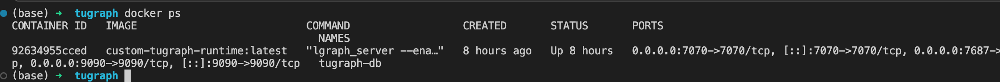
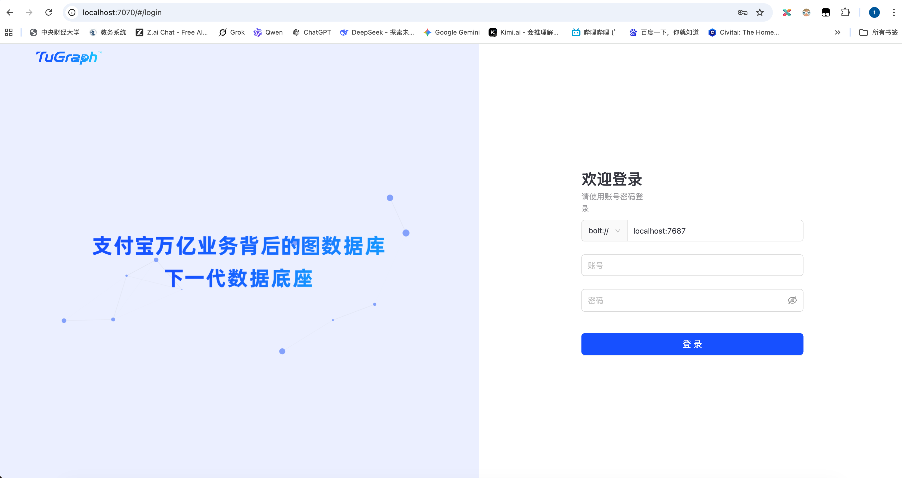
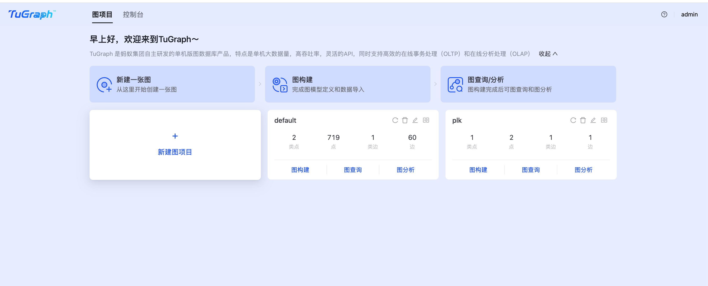
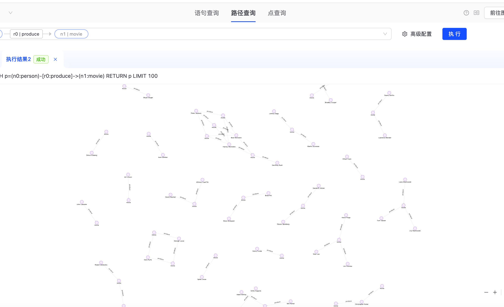

# 01-TuGraph 的部署与启动

## 0. 部署

按要求从 Docker Hub 下载镜像并启动容器：

```bash
docker run -d \
    -p "$HTTP_PORT" \
    -p "$BOLT_PORT" \
    -p "$RPC_PORT" \
    -v "$DATA_DIR:/var/lib/lgraph/data" \
    -v "$LOG_DIR:/var/log/lgraph_log" \
    --name "$CONTAINER_NAME" \
    "tugraph/tugraph-runtime-centos7:latest"
```

## 1. 启动

使用 `docker ps` 命令查看容器状态：



容器启动后，TuGraph 服务会自动运行并监听对应端口。其中 WebUI 为 7070，Bolt 为 7687。可以通过访问 [http://localhost:7070](http://localhost:7070) 来使用 TuGraph 的 Web UI。



输入账号密码成功登录：



## 2. WebUI 导入数据

### 1. 图构建
参考系统给出的格式模板和数据制作导入脚本：

```json
[
  {
    "label": "person",
    "type": "VERTEX",
    "primary": "id",
    "properties": [
      { "name": "id", "type": "INT32", "optional": false, "unique": true, "index": true },
      { "name": "name", "type": "STRING", "optional": false },
      { "name": "born", "type": "INT32", "optional": true },
      { "name": "poster_image", "type": "STRING", "optional": true }
    ]
  },
  {
    "label": "movie",
    "type": "VERTEX",
    "primary": "id",
    "properties": [
      { "name": "id", "type": "INT32", "optional": false, "unique": true, "index": true },
      { "name": "title", "type": "STRING", "optional": false },
      { "name": "tagline", "type": "STRING", "optional": false },
      { "name": "summary", "type": "STRING", "optional": true },
      { "name": "poster_image", "type": "STRING", "optional": true },
      { "name": "duration", "type": "INT32", "optional": false },
      { "name": "rated", "type": "STRING", "optional": true }
    ]
  },
  {
    "label": "produce",
    "type": "EDGE",
    "properties": [],
    "constraints": [
      ["person", "movie"]
    ]
  }
]
```
将csv数据上传并导入

检查数据情况

