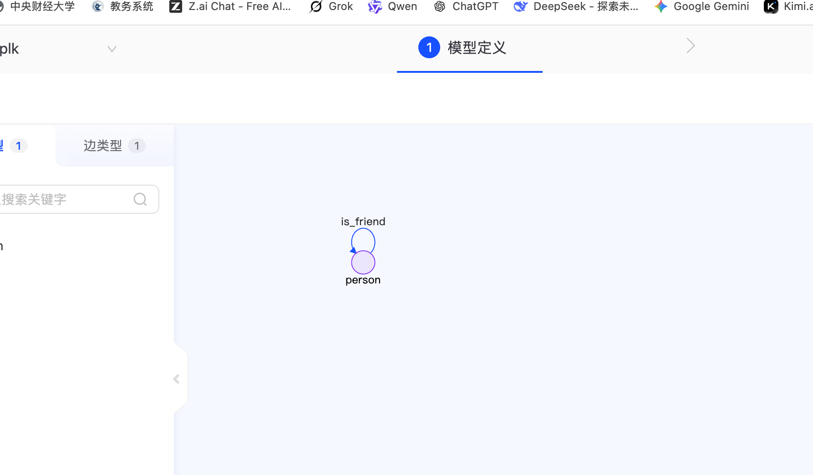

# Bolt协议导入导出数据

## 1. 环境准备
创建虚拟环境并安装依赖包
```bash
conda create -n tugraph python=3.12
conda activate tugraph
pip install neo4j
```    
## 2. 构建脚本
构建脚本如下：
ceshi_bolt_create.py
```python
from neo4j import GraphDatabase

URI = "bolt://localhost:7687"
AUTH = ("admin", "Plk161211.")
client = GraphDatabase.driver(URI, auth=AUTH)
session = client.session(database="plk")

# 清库（谨慎操作！）
session.run("CALL db.dropDB()")

# 创建顶点模型
session.run("CALL db.createVertexLabel('person', 'id' , 'id' ,'INT32', false, 'name' ,'STRING', false)")

# 创建边模型
session.run("CALL db.createEdgeLabel('is_friend','[[\"person\",\"person\"]]')")

# 创建索引
session.run("CALL db.addIndex(\"person\", \"name\", false)")

# 创建节点
session.run("create (n1:person {name:'jack',id:1}), (n2:person {name:'lucy',id:2})")

# 创建边
session.run("match (n1:person {id:1}), (n2:person {id:2}) create (n1)-[r:is_friend]->(n2)")

# 查询点边
res = session.run("match (n)-[r]->(m) return n,r,m")

# 参数化查询
cypherQuery = "MATCH (n1:person {id:$id})-[r]-(n2:person {name:$name}) RETURN n1, r, n2"
result1 = session.run(cypherQuery, id=1, name="lucy")
for item in result1.data():
    print(item)

session.close()
client.close()
```
运行结果如下：


