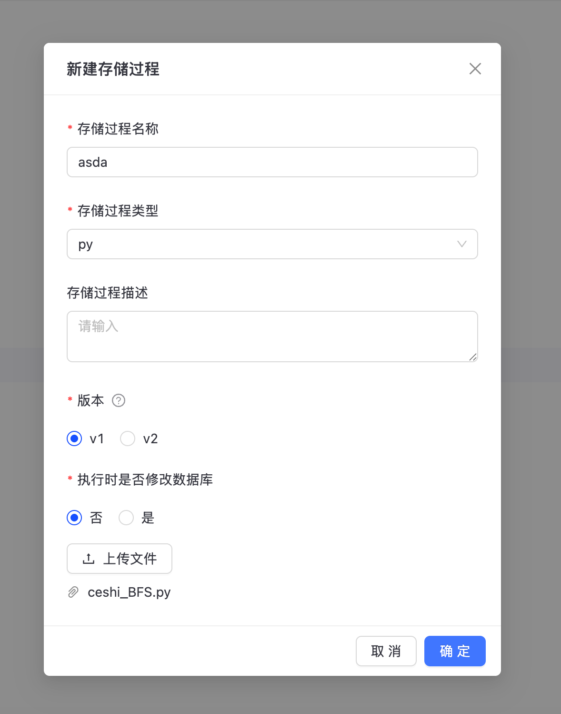
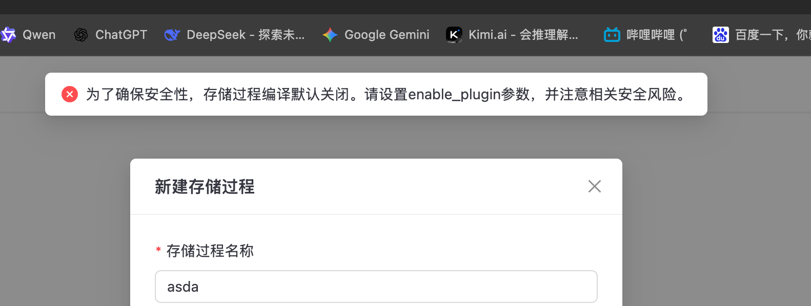
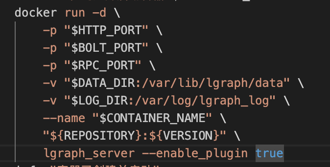
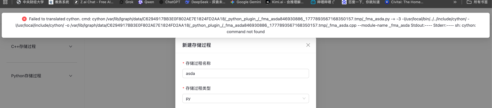
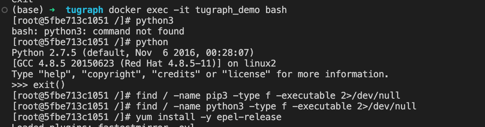
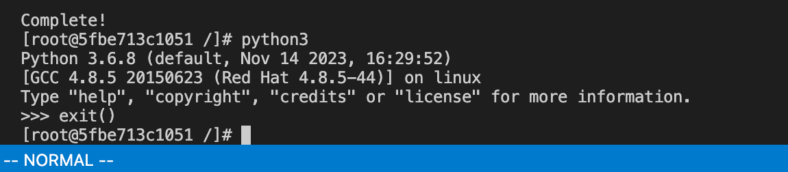
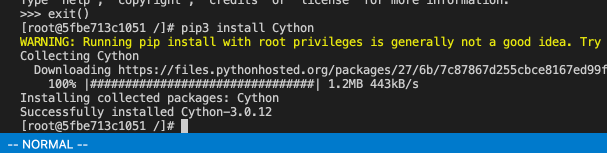
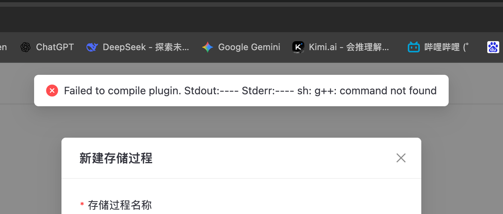
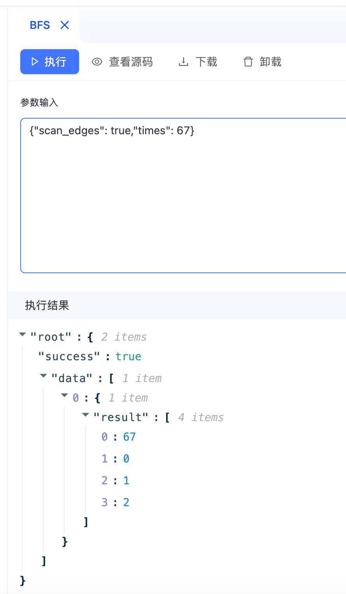

# 03-跑通存储过程

## 0. 新建存储过程
在TuGraph中点击新建存储过程，按要求填写并尝试上传代码

**ceshi_BFS.py**
```python
import json

def Process(db, input):
    # 1. 解析输入参数（默认输入为起始顶点ID，例如 "100" 或 "100,200"）
    raw_data =input
    parsed_data = json.loads(raw_data)
    if "times" in parsed_data:
        start_vid = int(str(parsed_data["times"]))

    # 2. 创建只读事务
    txn = db.CreateReadTxn()

    # 3. BFS 核心逻辑
    visited = {start_vid}
    queue = [start_vid]  # 生产环境建议改用 collections.deque 提升出队性能
    bfs_order = []

    while queue:
        current_vid = queue.pop(0)
        bfs_order.append(current_vid)

        vertex = txn.GetVertexIterator(current_vid)
        if not vertex.IsValid():
            continue

        # 遍历当前顶点的出边迭代器
        edge_it = vertex.GetOutEdgeIterator()
        while edge_it.IsValid():
            dst_vid = edge_it.GetDst()
            if dst_vid not in visited:
                visited.add(dst_vid)
                queue.append(dst_vid)
            edge_it.Next()

    # 4. 释放只读事务资源（只读查询推荐用 Abort）
    txn.Abort()

    # 5. 返回结果（TuGraph 插件标准格式：成功标志, 结果字符串）
    return (True, str(bfs_order))
```

## 1. 未启用enable_plugin报错
发现报错，显示未启用enable_plugin参数，修改对应启动参数并重新构建docker容器



## 2. 缺少依赖库报错
发现新的报错，提示缺少依赖库cython

全盘搜索发现镜像自带的python版本为python2，需要安装python3和cython库

为持久化配置环境，改用docker compose进行容器管理，配置Dockerfile和docker-compose.yml文件

**Dockerfile**
```Dockerfile
# 基于官方运行时镜像
FROM tugraph/tugraph-runtime-centos7:latest

# 安装 Python3 和 Cython
# 注意：在 CentOS 7 中，yum 依赖 Python 2.7。
# 我们在安装完所有包并执行完 yum clean 之后再处理软链接，
# 并且链接到 /usr/local/bin/python 以免破坏系统级工具。
RUN yum install -y python3 \
    && yum clean all \
    && python3 -m pip install --no-cache-dir Cython -i http://pypi.tuna.tsinghua.edu.cn/simple --trusted-host pypi.tuna.tsinghua.edu.cn \
    && ln -sf /usr/bin/python3 /usr/local/bin/python \
    && ln -sf /usr/local/bin/cython /usr/bin/cython

# 默认启动参数：启用存储过程
ENTRYPOINT ["lgraph_server"]
CMD ["--enable_plugin", "1", "-d", "run"]
```
**docker-compose.yml**
```yaml
services:
  tugraph:
    build: .
    container_name: tugraph_demo
    ports:
      - "7070:7070"
      - "7687:7687"
      - "9090:9090"
    volumes:
      - /root/tugraph/data:/var/lib/lgraph/data
      - /root/tugraph/log:/var/log/lgraph_log
    restart: always
```
修改后可以正常进入容器，检查看到正确的python版本以及cython


再次运行报错，显示g++版本过低（4.8.x），无法运行c++ 17

运行以下命令更新g++版本并替换默认编译器：
```bash
yum install -y centos-release-scl
yum install -y devtoolset-9-gcc devtoolset-9-gcc-c++
# 备份旧版本的编译器
mv /usr/bin/g++ /usr/bin/g++_old
mv /usr/bin/gcc /usr/bin/gcc_old

# 建立指向新版本的全局软链接
ln -s /opt/rh/devtoolset-9/root/usr/bin/g++ /usr/bin/g++
ln -s /opt/rh/devtoolset-9/root/usr/bin/gcc /usr/bin/gcc
```

运行发现CentOS 7 已经停止维护，切换源：
```bash
sed -i 's/mirrorlist=/#mirrorlist=/g' /etc/yum.repos.d/CentOS-*.repo
sed -i 's/#baseurl=/baseurl=/g' /etc/yum.repos.d/CentOS-*.repo
sed -i 's/mirror.centos.org/vault.centos.org/g' /etc/yum.repos.d/CentOS-*.repo

# 清理缓存并重新生成缓存
yum clean all
yum makecache

# 禁用损坏的仓库并重新安装g++
yum --disablerepo=centos-sclo-sclo install -y devtoolset-9-gcc devtoolset-9-gcc-c++

# 创建软链接
# 建立软链接到系统默认的 64 位库搜索路径
ln -s /usr/local/lib64/lgraph/liblgraph.so /usr/lib64/liblgraph.so

# 建立软链接到 32 位库搜索路径
ln -s /usr/local/lib64/lgraph/liblgraph.so /usr/lib/liblgraph.so

# 刷新系统的动态链接库缓存，让刚才的修改立即生效
ldconfig
```
重新上传存储过程，正确执行

需要注意，**ceshi_BFS.py** 存储过程脚本接收的是 TuGraph 的内部顶点标识符 (VID)，而非 CSV 文件中定义的属性 ID。在调用时，需先通过 Cypher 查询获取对应实体的 VID（如：MATCH (n:person {id:
  15}) RETURN ID(n)），再将该 VID 作为参数传入存储过程，方可得到正确的遍历路径。

